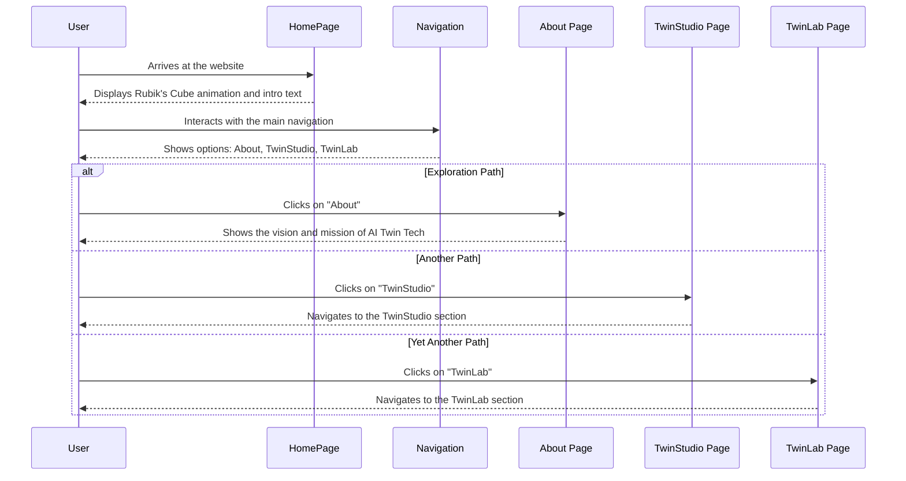
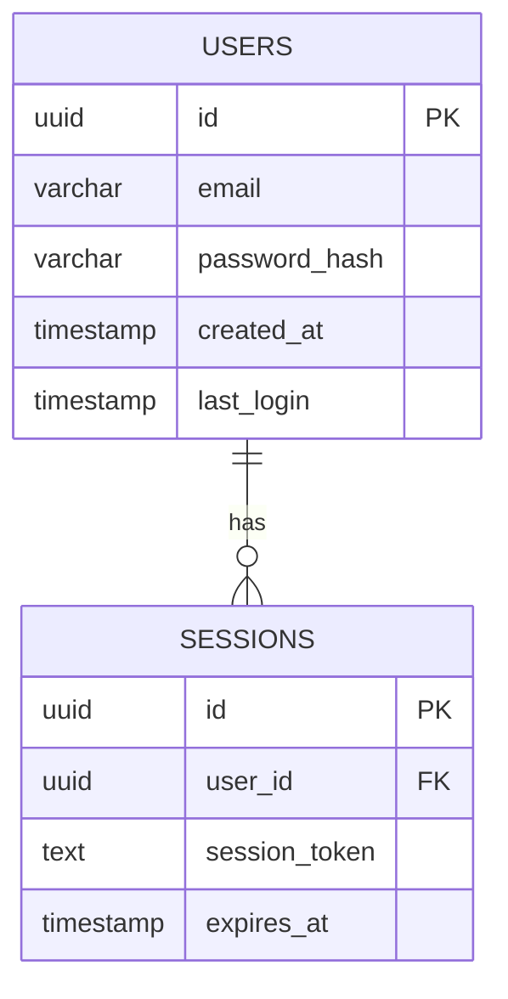
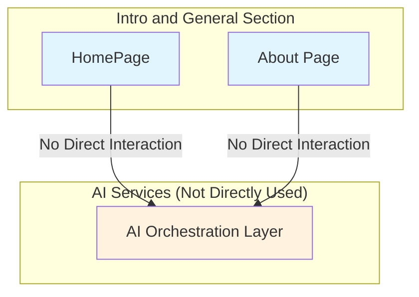
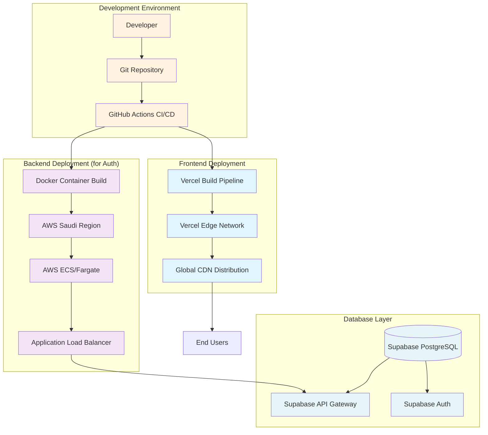

# Intro and General: Technical Architecture Diagrams

This document provides an overview of the technical architecture diagrams for the "Intro and General" section of the AI Twin Tech website.

## 1.0 System Architecture

```mermaid
graph TB
    subgraph "User Journey Flow"
        U[User] --> HomePage[Home Page]
        HomePage --> Nav[Main Navigation]
        Nav --> AboutPage[About Page]
        Nav --> TwinStudioPage[TwinStudio Page]
        Nav --> TwinLabPage[TwinLab Page]
        Nav --> LoginPage[Login Page]
    end

    subgraph "Frontend Layer"
        HomePage --> React[React 18 + Vite]
        React --> Header[Header Component]
        React --> Footer[Footer Component]
        React --> RubiksIframe[RubiksIframe Component]
        React --> Routing[React Router]
    end

    subgraph "Backend Layer"
        React --> APIRoutes[API Routes (for auth)]
        APIRoutes --> ExpressServer[Express Server]
        ExpressServer --> AuthController[Auth Controller]
    end

    subgraph "Data Layer"
        AuthController --> Supabase[Supabase PostgreSQL]
        Supabase --> UsersTable[Users Table]
    end

    subgraph "Infrastructure Layer"
        ExpressServer --> Vercel[Vercel Deployment]
        Supabase --> AWS[AWS Saudi Region]
    end

    classDef frontend fill:#e1f5fe
    classDef backend fill:#f3e5f5
    classDef data fill:#e8f5e8
    classDef infra fill:#fce4ec

    class React,Header,Footer,RubiksIframe,Routing frontend
    class APIRoutes,ExpressServer,AuthController backend
    class Supabase,UsersTable data
    class Vercel,AWS infra
```

## 2.0 User Journey



## 3.0 Database Schema



## 4.0 AI Services



## 5.0 Component Architecture

```mermaid
graph TD
    subgraph "React Component Hierarchy"
        App[App.tsx] --> AppLayout[AppLayout]
        AppLayout --> Header[Header Component]
        AppLayout --> Outlet[React Router Outlet]
        AppLayout --> Footer[Footer Component]

        Outlet --> HomePage[HomePage]
        HomePage --> RubiksIframe[RubiksIframe]
        HomePage --> Hero[Hero (intended)]
        HomePage --> Frame[Frame (intended)]
    end

    subgraph "UI Components Library"
        shadcn[shadcn/ui] --> Button[Button]
        shadcn --> Card[Card]
    end

    subgraph "Hooks & State Management"
        AuthContext[AuthContext] --> useAuth[useAuth Hook]
        ReactRouter[React Router] --> useNavigate[useNavigate Hook]
        ReactRouter --> useLocation[useLocation Hook]
    end

    Header --> useAuth
    Header --> useNavigate
    Header --> useLocation

    classDef components fill:#e1f5fe
    classDef ui fill:#f3e5f5
    classDef state fill:#fff3e0

    class App,AppLayout,Header,Outlet,Footer,HomePage,RubiksIframe,Hero,Frame components
    class shadcn,Button,Card ui
    class AuthContext,useAuth,ReactRouter,useNavigate,useLocation state
```

## 6.0 Deployment Architecture


