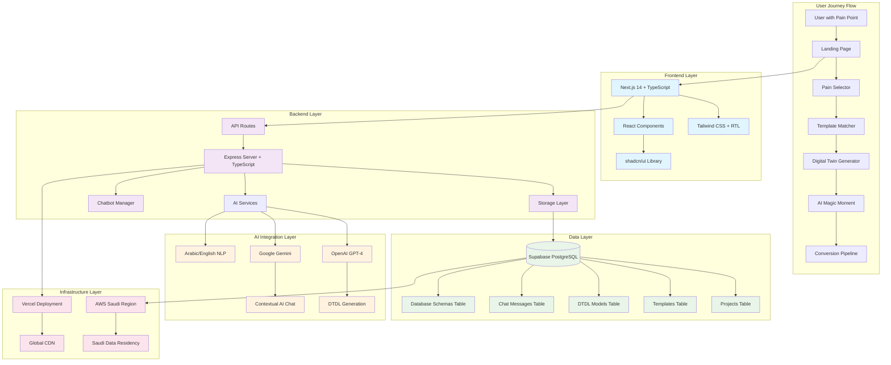
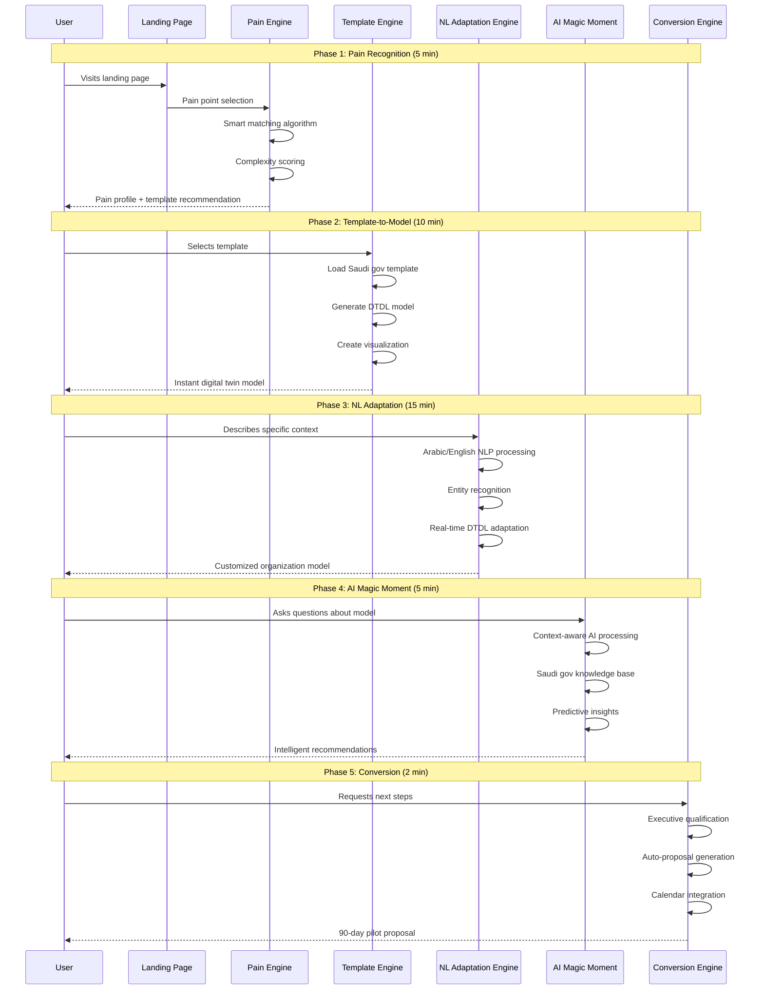
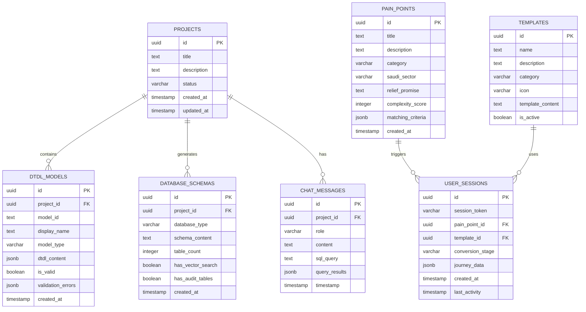
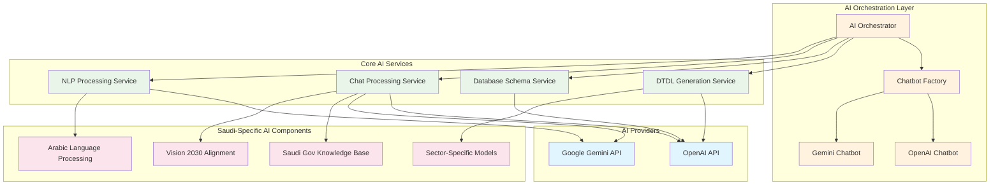
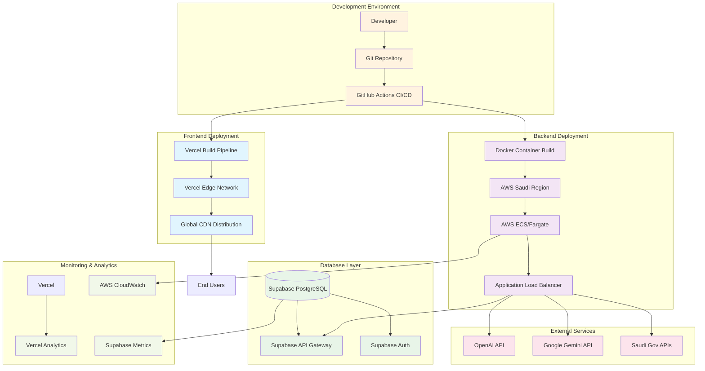

# TwinSchema Technical Architecture Diagrams

## System Architecture Overview

## Pain-to-Relief Technical Flow

## Database Schema Architecture

## AI Services Architecture

## Component Architecture

```mermaid
graph TD
    subgraph "React Component Hierarchy"
        App[App.tsx] --> Header[Header Component]
        App --> WorkflowTabs[Workflow Tabs]
        
        WorkflowTabs --> DescriptionTab[Description Tab]
        WorkflowTabs --> DTDLTab[DTDL Tab]
        WorkflowTabs --> DatabaseTab[Database Tab]
        WorkflowTabs --> ChatTab[Chat Tab]
        
        DescriptionTab --> TemplateSelector[Template Selector]
        DescriptionTab --> PainPointMatcher[Pain Point Matcher]
        
        DTDLTab --> DTDLViewer[DTDL Model Viewer]
        DTDLTab --> DTDLGenerator[DTDL Generator]
        
        DatabaseTab --> SchemaViewer[Schema Viewer]
        DatabaseTab --> SchemaGenerator[Schema Generator]
        
        ChatTab --> ChatInterface[Chat Interface]
        ChatTab --> AIContextProvider[AI Context Provider]
    end

    subgraph "UI Components Library"
        shadcn[shadcn/ui] --> Button[Button]
        shadcn --> Card[Card]
        shadcn --> Tabs[Tabs]
        shadcn --> Dialog[Dialog]
        shadcn --> Form[Form]
        shadcn --> Textarea[Textarea]
        shadcn --> CodeEditor[Code Editor]
    end

    subgraph "Hooks & State Management"
        QueryClient[TanStack Query] --> APIHooks[API Hooks]
        ToastHook[Toast Hook] --> Notifications[Notifications]
        MobileHook[Mobile Hook] --> ResponsiveUI[Responsive UI]
    end

    DescriptionTab --> Button
    DTDLTab --> CodeEditor
    DatabaseTab --> CodeEditor
    ChatTab --> Form
    
    DescriptionTab --> QueryClient
    DTDLTab --> QueryClient
    DatabaseTab --> QueryClient
    ChatTab --> QueryClient

    classDef components fill:#e1f5fe
    classDef ui fill:#f3e5f5
    classDef state fill:#fff3e0

    class App,Header,WorkflowTabs,DescriptionTab,DTDLTab,DatabaseTab,ChatTab components
    class shadcn,Button,Card,Tabs,Dialog,Form,Textarea,CodeEditor ui
    class QueryClient,APIHooks,ToastHook,MobileHook state
```

## Deployment Architecture

## Key Architectural Patterns

### 1. **Progressive Enhancement Pattern**
- Landing page → Pain recognition → Template matching → AI enhancement → Conversion
- Each phase builds upon the previous, creating increasing engagement

### 2. **Saudi-First Design Pattern**
- Arabic language support at every layer
- Government compliance and security standards
- Vision 2030 alignment in all AI models and templates

### 3. **Dual-AI Provider Pattern**
- OpenAI for DTDL generation and technical tasks
- Google Gemini for conversational AI and Arabic processing
- Redundancy and cost optimization

### 4. **Pain-Driven Architecture Pattern**
- Every technical component serves the pain-to-relief user journey
- Data models optimized for Saudi government transformation scenarios
- AI training focused on government domain expertise

### 5. **Conversion-Optimized Pattern**
- Technical stack optimized for 3 high-quality conversions
- Executive-level features and presentation
- 90-day pilot proposal automation